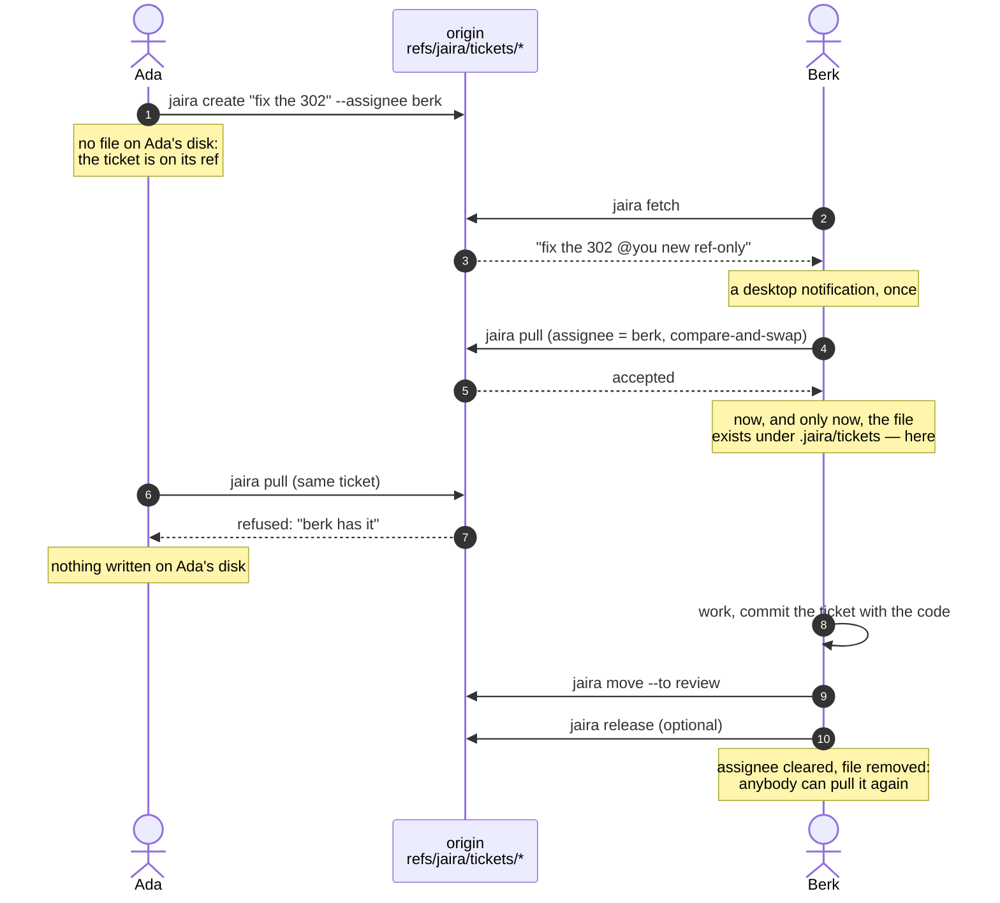

<p align="center">
  
</p>

A kanban board for the work you do with coding agents, stored as markdown files
inside your repository.

Hand a coding agent one task and it reliably becomes five. Within a session that
is fine. Across sessions it is not: what each sub-task was *for* and where it got
to both evaporate, and there is no artifact left to reconstruct them from.

jaira makes that state durable and visible. Tickets travel with the code: a
teammate clones, runs `jaira fetch`, and sees the same board. No server, no
accounts, no setup.

```
repo/                              ~/.jaira/
├── .jaira/                        ├── lanes/       your custom lanes
│   └── tickets/*.md               ├── projects.json
└── src/                           └── state/<worktree>/   sessions, locks
```


One window over every project, with the whole flow on one screen: a dot per
ticket, agents counted per step, and the arrow lit where work just moved:


The repository holds only tickets. Everything ephemeral (what each session is
focused on, write locks) lives under your home directory, so `.jaira/` never
mixes committed content with scratch state.

## Install

```bash
curl -fsSL https://raw.githubusercontent.com/BeMuCa/jaira/master/scripts/install.sh | sh
```

That downloads the latest release for your OS, verifies its checksum, and puts
the binary in `~/.local/bin` (override with `JAIRA_INSTALL_DIR`). Or build from
source:

```bash
go install github.com/BeMuCa/jaira/cmd/jaira@latest
```

Or download a binary from the releases page and put it on your `PATH`. Either
way it is a single static executable with no runtime dependency: nothing to
install alongside it, no daemon, no database.

`git` is optional. jaira works fine in a directory that is not a repository; you
only lose the parts that are about sharing (`jaira share`, the merge driver).

### Upgrading

```bash
jaira self upgrade
```

Replaces the binary in place with the latest release, verifying its checksum
first, the same way the install script does. `--check` reports what is
available without installing anything; `--version vX.Y.Z` installs that exact
release, including going back to an older one. A Homebrew or `go install`
build is refused with the right command for that install instead — jaira
never overwrites a file another tool owns.

jaira checks for a new release at most once a day, in the background, and
never on the command path: nothing you run ever waits on the network for
this. The result shows up as a small status line in the footer of the
launcher and the board — `jaira v0.1.0 · up to date` or
`jaira v0.1.0 · v0.2.0 available — run: jaira self upgrade` — never as a
line from a CLI command, which stay quiet so a script or an agent driving
jaira is never interrupted by it. Set `JAIRA_NO_UPDATE_CHECK=1` to turn the
check off entirely; the version still shows, just without the "up to
date"/"available" half.

This is different from `jaira update`, just below, which is about a
*repository's* board setup and downloads nothing.

## Start

```bash
cd your-repo
jaira init      # creates .jaira/, private and gitignored
jaira           # opens the board
```

**A board starts private.** `init` gitignores it, so your tickets are yours alone.
When you want the team to have them:

```bash
jaira share
git add .jaira .gitignore && git commit -m "share jaira board"
```

Publishing is a decision rather than a default, because the tool cannot know whether your
notes are ready to be read by everyone who can clone the repository. `jaira share
--undo` makes it private again; nothing about the tickets changes either way, so
it is not a migration.

Teammates then clone, run `jaira fetch`, and have the board; the merge driver
binds itself on first use.

The team flow is pull-based. A captured ticket belongs to nobody; whoever pulls
it out of the backlog becomes its assignee in the same move. Pull before you
pick, push after you pick, and a teammate's claim shows on the card as an
@-marked name in a colour of its own.

## A ticket

```markdown
---
id: 01KZSAMZMANMNFNHS05J0VAG6T
title: Fix session cookie dropped on 302
status: in-progress
ready: true
creator: berk
assignee: berk
executed-by: haiku
goal: Session must survive the OAuth round-trip
context: |-
  Reported in chat while debugging Safari logouts. The cookie is dropped
  cross-site on the OAuth redirect, so users are silently logged out
  mid-flow. Reproduced on Safari only.
blocked-by: []
commits:
  - 4f2a1c9
model-tier: cheap
outcome-what: Set SameSite=Lax and re-issued the cookie on 302
outcome-why: The cookie was dropped cross-site, silently logging users out
outcome-resolves: >-
  The DoD asked for survival across the OAuth round-trip; re-issuing on
  redirect closes the gap, verified by session_test.go
created-at: 2026-08-11T21:11:27Z
updated-at: 2026-08-11T21:14:03Z
updated-by: berk
---

# Fix session cookie dropped on 302

## Definition of Done

- [x] session survives the OAuth round-trip
- [x] covered by a test
- [ ] reviewed and merged
```

The file format *is* the API. It is hand-editable, and writing one field rewrites
only that field's bytes, so a lane change shows up in git as a one-line diff, not
a reformatted file.

Three details are load-bearing:

- **`assignee` is always a human**, even when an agent does the work. The model is
  recorded separately as `executed-by`. Ownership of an outcome does not transfer
  to a language model.
- **`outcome-resolves`** is not a restatement of what changed. It is the argument
  that the change satisfies the definition of done, enough to review without
  opening the code.
- **The definition of done is a checklist in the body**, not a frontmatter string,
  because that is how acceptance criteria are actually written. It also earns its
  keep at the terminal lane: a ticked box is a human editing a file, which is
  evidence a model asserting "it works" cannot manufacture.
- **`external:`** is reserved for a future Jira/YouTrack adapter. jaira never
  interprets it and never rewrites it.

## The lanes

```
BACKLOG → TODO → PRE-PROCESS → IMPLEMENTING → HITL → REVIEW → HUMAN REVIEW → DONE
                                                │                   ▲
                                                └ needs you ────────┘        + BLOCKED
```

Anything can be thrown into the backlog. Nothing *leaves* it without a goal, a
definition of done, the context it came from, and an assignee.

That gate is the point of the tool. Capture should be frictionless and execution
should not be: an agent that starts work with no checkable target produces work
you cannot review. Acquiring a definition of done is the price of admission to a
run.

`REVIEW` is a **human checkpoint**: no agent may move a ticket out of it. The
review agent writes its verdict and stops; you accept the work in the board, or
raise a follow-up ticket that carries the context across and links back.

`DONE` requires every checklist item marked done, and the plan finished too, if
the ticket has one, since the criteria cannot have been met while the work that
meets them is still in progress. It also requires the commits that carry the
change recorded on the ticket: the requirement sits where work is accepted, so
a ticket can move through review before it is committed, but nothing is
accepted that cannot be checked.

`BLOCKED` refuses a ticket that cannot say what it is waiting on. Pass
`--reason "..."` on the move, or record the blocking ticket in `blocked-by`,
which counts as the answer.

A review agent cannot certify its own work. This is not politeness about AI: LLM-as-judge
is measurably poor at catching real defects, so a terminal
state gated on a model's own assessment would mean nothing. There was once a
`--signal` flag that accepted free text as evidence and never checked it; it was
removed rather than repaired.

## Lanes are pipeline stages

A lane can bind a prompt, a model tier, and an input/output contract. That turns
the board from a progress display into a pipeline you can watch: a cheap model
implements, an expensive one reviews.

**A board is its lane directory.** Whatever lane files `.jaira/lanes/` holds
are the board — all of it, in the order of the `order` file beside them, and
nothing is added underneath. A new board gets its files written on first use:
your default board's selection, or the ten shipped lanes. Remove a lane and its
file goes; the shipped lanes stay on offer in the catalogue, and `jaira lanes
add` brings one back. The directory is yours and gitignored, so two people on
one shared board can run two different boards.

Custom lanes are single files in `~/.jaira/lanes/`, the catalogue, so sharing
one is sending someone the file.

**Lanes other people made** live in this repository's [`lanes/`](lanes/)
directory — the marketplace, which is nothing more than that directory.
`jaira lanes market` lists them; `jaira lanes market adopt <id>` puts one in
your catalogue; `jaira lanes add <id>` puts it on a board. **To add yours, open a
pull request with one file under `lanes/`.** CI parses every file there, so a
lane that does not load fails the build rather than the person who adopts it.
Read a lane before you adopt it: adopting means running its prompt at the model
tier it declares.

```markdown
---
id: critique
name: Critique
after: review
precedence: 55
agentic: true
model-tier: strong
input-requires: [goal, definition-of-done, outcome-what, diff]
output-produces: [outcome-resolves]
---
# Prompt

Look for defects the implementer would not have noticed...
```

Ask the tool to assemble the input rather than letting the agent decide what
context matters:

```bash
jaira show JJN9KH --for-lane critique --json
```

That returns the prompt, only the declared fields, and the diff of the ticket's
own commits. If the agent chose its own context, the contract would be a
suggestion.

Both agent files (`CLAUDE.md`, `AGENTS.md`) carry a generated block naming this
board's lanes in order, any loop a lane declares, and for each lane whether an
agent may work it at all. It also says the thing that is easy to assume wrong:
nothing runs by itself. A lane's prompt fires because a session ran it, and
`jaira next --per-lane` is how that session finds the lane with work waiting.

That block follows the board rather than waiting to be refreshed: adding,
adopting, removing or reordering a lane rewrites it, from the CLI and from the
settings screen alike. A lane file edited by hand goes through neither, so
`jaira validate` reports when the block and the lanes have drifted apart. Text
after a `jaira:local` marker you add inside the block survives every rewrite, so
a project's own rules live with the note instead of contradicting it from
outside.

A teammate without your `critique` lane still sees those tickets, in a read-only
passthrough column. Hiding them would be the worse failure.

## Tickets travel on their own git refs

Hand someone a ticket today and they learn nothing: the ticket file lives in
the branch of whoever wrote it, and if that branch is unpushed, stale or
force-pushed, the assignee sees neither the title nor the id. Scanning every
branch for ticket files is expensive and still wrong.

So every write also puts the ticket on a ref of its own:

```
refs/jaira/tickets/<id>      one ref per ticket, its tree carries <id>.md
```

That ref belongs to no branch. The default refspec does not fetch it, so a
teammate who does not use jaira sees none of it, and it never shows up as a
branch or in a hosting provider's web UI. The tree carries the whole ticket
file rather than just an id, so the other side reads it with no checkout and
nothing to merge:

```bash
jaira fetch                                     # one round trip, no branch
git show refs/jaira/tickets/<id>:<id>.md        # or read it by hand
```

`jaira fetch` marks each card `@you`, `new`, and `ref-only` — the last being
the property that matters: this ticket is in no branch you have. A ticket that
has just become yours also raises a desktop notification, once, and the board
fetches on its own every minute.

**The push is a compare-and-swap.** Each ref commit takes the SHA you read as
its parent, so a stale write is a non-fast-forward that git rejects by itself,
and `--force-with-lease` covers the first write, where no commit has a parent
to compare. A race is detected on the spot rather than three days later at a
merge, and the message names who was quicker and where the ticket now is.

**Writing works offline.** A write is queued, not pushed: sending happens
after the command, and only in a process that actually wrote something, so
`jaira list` never waits for a remote. If there is no route, the ticket is
correct locally, the card says `unsent`, and it goes out with your next
command. This is also why the board and the git merge driver can write tickets
at all — neither may block on a network.

**The ticket file stays in the code commit as well**, and the two answer
different questions:

| | File in the commit | Ref |
|---|---|---|
| Answers | what this change was, and why | where the ticket stands now, and with whom |
| Read by | the reviewer of the diff | the board, notifications, another machine |
| Changes | once, with the code | on every move, claim, note |
| Lives | permanently, in the history | while the ticket is on the board |

On the board it is one story per ticket, not two panes to compare: the local
file and the ref are merged field by field by the same resolver the merge
driver uses (see **Concurrency** below), with the ref's parent blob as the
merge base. Progress is never reverted — a local edit made a minute ago cannot
drag a ticket back out of review because a reviewer touched it first.

`~/.jaira/settings.json` holds the three choices this needs, all optional:

```json
{ "remote": "origin", "notify-off": false, "hook": "/path/to/script" }
```

The hook is called on `move` and `claim` for delivery that does not wait for
the other side to fetch. jaira only calls it and brings no dependency of its
own: the script gets `JAIRA_EVENT`, `JAIRA_TICKET`, `JAIRA_TITLE`,
`JAIRA_STATUS`, `JAIRA_ASSIGNEE`, `JAIRA_ACTOR` and `JAIRA_ROOT` in its
environment, and what it does with them — a Slack webhook, ntfy.sh, Telegram —
is yours.

**The fork limit, stated plainly:** refs do not travel across forks. Everyone
taking part pushes to the same board repository, which means participation
requires push access to it. A contributor without push access keeps the ticket
file in their branch and their pull request; they lose the ref channel, not the
board. A board in a directory that is not a repository, or with no remote,
simply does not use refs and behaves exactly as before.

## How two people hand work over

A ticket nobody is working lives on its ref and nowhere else. Pulling it is
what puts it on your disk, and that pull is a compare-and-swap, so exactly one
person can be holding it:



Reading the board needs no pull: `jaira list`, `jaira next` and `jaira show`
include tickets that are still on their refs and mark them `[pull it]`. Every
write refuses them with exit 3 and says which command changes that — a ticket
you have not pulled is one you are not holding, and half-writing it is the one
thing this rules out.

**What each step buys**

| Step | Why it is that way |
|---|---|
| `create` writes only the ref | While nobody is working it, a file in somebody's checkout is a copy a merge can duplicate, and it hides who the ticket belongs to |
| an assignment does not materialise anything | Assigning reserves the ticket; the assignee still pulls it themselves, and which branch they work in is not the assigner's business |
| `pull` pushes first, writes the file second | The other order leaves the loser of a race holding a file that belongs to somebody else |
| the ref's `assignee` gates the pull | The compare-and-swap only rules out two writes in the same instant; it cannot say "this is not yours", because a pull re-reads the ref right before writing |
| `release` clears the ref, then removes the file | Without it an assignment is a reservation nobody can hand back |

A board with no remote behaves exactly as it always did: the file is the board.
That branch is decided in one place, so no command has to know which mode it is
in.

## The backup branch, and when a ref dies

A ticket nobody is working lives only on its ref, so an untouched backlog lives
only on the remote. Every participant's clone holds the refs it has fetched, so
the board survives any one machine — but somebody cloning for the first time has
no refs at all. For them there is a branch:

```
jaira/board            parentless, never merged, one commit per change
└── board/<id>.md      the same ticket files, at a path of their own
```

It is built with git plumbing and never checked out, so a run cannot disturb
whatever you are in the middle of, and it is rebuilt from the current set of
refs each time — so a ticket that has gone is simply not in the next snapshot
and stays readable in the previous ones. `git log jaira/board` is the board's
history and `git diff` between two snapshots says what moved.

```bash
jaira snapshot                # normally nobody runs this
```

It happens by itself, in a detached background process, when the last snapshot
is more than three days old — never on the command path, so nothing you type
waits for it. Three days is not thrift: the working state is always on the refs
and every clone has them, so this is the backup for the slow cases only. The
files live under `board/`, not `.jaira/tickets/`, because at the same path the
first accidental merge of this branch would collide with every working ticket at
once.

**A ref is removed only once its ticket has arrived somewhere everybody can
see.** Filing a ticket away — `jaira logbook`, `jaira archive` — writes its
final state to the ref and leaves it standing. At that moment the ticket file is
only in your branch, and taking the shared copy down too would hide the ticket
from everybody for as long as a review takes; somebody would notice the same
problem and write it down a second time.

The ref goes in the snapshot run, immediately after the write, for tickets that
are filed away in a landing branch. That order is the point: at the moment of
deletion the ticket is in the snapshot *and* in the branch it landed in, so
there is nothing left to lose.

```json
{ "landing-branches": ["main", "develop", "release/*"] }
```

A list rather than one "main branch", because there is no answer to what the
important branch is called. With nothing configured, the remote's own HEAD is
used; if even that cannot be resolved, **nothing is ever removed** — a ref left
standing costs nothing, one removed by mistake takes away exactly the visibility
this is for.

A branch that never gets merged would otherwise keep its ref for ever, so
`jaira fetch` and `jaira validate` name any ticket that was finished here and
has not arrived after a week. `jaira snapshot --drop <id>` is the way out, and
it is deliberately a person's decision.

## Concurrency

Two people moving the same ticket both rewrite the same `status:` line. Line-based
merging calls that a conflict, on the single most common operation the whole system
performs.

So `jaira init` registers a **field-aware merge driver** for the clone:

| Field | Resolution |
|---|---|
| `status` | whichever lane is further along; never revert progress |
| `blocked-by`, `commits` | union; neither side's addition is lost |
| other scalars | the more recent `updated-at` wins |
| prose (`goal`, `outcome-*`, body) | a real conflict, scoped to that field |

A conflicted ticket stays valid YAML: the contested value is parked in a
`conflict-theirs-<field>` key and listed under `merge-conflicts`, rather than the
file being filled with markers. Conflict markers would make the frontmatter
unparseable and blank the ticket on everyone's board until someone resolved it.
`jaira resolve` shows both sides and can take either.

Registration writes to `.git/config`, because git deliberately does not let a
clone configure an executable on your behalf. jaira says so when it does it rather
than acting quietly.

Known limit: merge drivers only run for merges git performs locally. A conflict
resolved through a hosting provider's web UI falls back to line-level markers.

Within one machine, concurrent CLI calls take a per-ticket lock and write
atomically, because a single write path prevents schema drift but does nothing
about two processes interleaving.

## With Claude Code

Install the skill from `.claude/skills/jaira/` and Claude will use the CLI
directly. Optionally install `hooks/sync-tasks.sh` as a `PostToolUse` hook on the
task tools to mirror Claude's task list into the backlog.

Mirrored tickets land in the backlog behind the gate. Lane movement is
deliberately *not* mirrored: letting an external status push a ticket into the
pipeline would route around the gate that makes the pipeline worth having.

The sync is idempotent. A task already mapped to a ticket updates it rather than
creating a second one, and an unchanged list writes nothing, so a
board→tasks→board round trip settles instead of oscillating.

`jaira hook print` emits a second, unrelated hook: a `Stop` hook that refuses to
end a session while an agentic lane still holds work. A lane's prompt already
says where a ticket goes next, and `jaira move` now names the command that works
the lane it landed in — but both are advice a model can drop, and the hook is
the environment refusing. It fails open (no board, no jaira on `PATH`, a stop it
has already blocked once) so it cannot trap you in a session.

## Working with an agent

The whole integration surface is: run a command, read the JSON, branch on the
exit code. Nothing is specific to one tool: Claude Code, Codex, Aider, a local
model behind Ollama, or a shell script all drive it the same way.

```bash
jaira next --json                              # what should I work on?
jaira show <id> --for-lane in-progress --json  # the prompt and bounded input
jaira dod <id> 2 --doing --plan                # say where you are
jaira note <id> "the exporter buffers everything in writeAll()"
jaira move <id> --to review --what ... --why ... --resolves ... --commits "$(git rev-parse HEAD)"
```

Starting a session, `jaira resume --json` returns everything left mid-flight with
the notes written against it. A session that died to a usage limit leaves
nothing behind except what was written down.

Two things an agent deliberately cannot do: leave the human review lane, and close a
ticket whose definition of done is unmet. See **[docs/AGENTS.md](docs/AGENTS.md)**.

## Reviewing finished work

A ticket in human review opens to the four questions the decision actually needs
(what was wrong, what was done, why, and whether it holds), with the implementer's
account and the reviewer's verdict kept apart, because when they disagree that is
the most useful thing on the screen:


Accepting it moves the ticket to done. It leaves the board once you push the
work, in that order: `jaira logbook <id>` files it under the day you finished
it, with its commits stamped, and doing that before the push would hand a
teammate a board that has forgotten the ticket while the code it describes has
not arrived. `jaira archive <id>` is for a ticket that is *not* being worked —
abandoned, duplicate, obsolete — and works from any lane. Nothing is deleted,
`jaira restore` puts either back, and a follow-up keeps its link to a logged
predecessor.

## Commands

```
jaira                      open the home screen: your boards, and what each needs
jaira board                open the board here directly
jaira init                 prepare a repository
jaira update               re-apply setup after upgrading
jaira self upgrade         replace the jaira binary with the latest release
jaira create <title>       create a ticket
jaira list                 list tickets
jaira show <id>            show one ticket
jaira set <id> k=v...      set fields
jaira dod <id> <n>         mark a checklist item --doing / --done / --todo / --superseded
jaira validate             check every ticket on the board for damage
jaira logbook <id>         file a finished ticket under today, commits stamped
jaira archive <id>         take a ticket that is not being worked off the board
jaira delete <id>          remove a ticket's file for good (type the handle back)
jaira move <id> --to ...   move lanes, applying the gates
jaira next                 the next actionable ticket
jaira fetch                fetch the tickets travelling on their own git refs
jaira pull <id>            take a ticket over and put it on your disk
jaira release <id>         hand a ticket back so somebody else can take it
jaira snapshot             write the board's backup branch and clear landed refs
jaira claim <id>           take a 30-minute lease on a ticket
jaira lanes                installed lanes
jaira checkpoint           record what this session is doing
jaira sessions             sessions working this tree
jaira sync-tasks           mirror an agent task list into the backlog
jaira tasks                emit the board as a task list
jaira resolve <id>         settle the fields a merge could not resolve
jaira projects             boards you have opened
jaira projects add <path>  register a board (--scan searches two levels down)
jaira share                publish the board (--undo to make it private)
```

Full reference: **[docs/COMMANDS.md](docs/COMMANDS.md)**.

Every read command takes `--json`. Exit codes are a stable contract:

| Code | Meaning |
|---|---|
| 0 | success |
| 1 | unexpected error |
| 2 | usage error |
| 3 | a gate refused the operation |
| 4 | unresolved dependencies |
| 5 | no such ticket, or an ambiguous id |

Under `--json`, refusals are structured on stderr with a `field` naming what to
supply, so an agent can fix and retry without parsing prose.

## Keys

```
h l ← →   lane            enter   open ticket      n   new ticket
j k ↓ ↑   card            /       filter (key:value narrows to one field)
g G       first / last    m       move ticket      ?   help
v         compact view    x       archive          r   reload
z         hide empty lanes        q   quit
S         settings: lanes and the default board

Compact view (v): the whole flow as steps with arrows, agents counted per step,
an arrow lit when work just moved. ad/←→ pick a step, enter opens it full width,
1-9 switch project.

In an opened step: jk ticket, gG first/last, hl next/previous lane (stays in
this view), enter open ticket, q/esc/v back to the compact view.

In an open ticket:
e   edit fields (enter newline, ctrl+s save)     a   accept (at a checkpoint)
E   edit body and checklists in $EDITOR          f   follow-up from the review
y   copy the full ticket id                      n   follow-up beside this one
b   open the ticket this one is blocked by       m   move it
X   delete its file (type the handle back)       tab other pane, in the split
jk  next / previous ticket
↓↑ scroll (ctrl+d/u pages) a ticket taller than the terminal

On the board list (p, and the launcher):
x   remove a board — choose what goes, the cursor starts on No
```

Every screen is clamped to the terminal: a line wider than the window is cut
rather than wrapped, because a wrapped line pushes everything under it down and
shoves a footer off the bottom. Screens with more to say than fits — the help,
an open ticket — scroll with `↓↑`.

Writing a follow-up (`n`): the screen splits, the ticket it follows stays on the
left, and the new one is written on the right, so the reason for it is still
visible while you write it. It is a draft until `ctrl+s` writes it into the
backlog with `follows` pointing back; `esc` discards it and the board never saw
it. `n` again chains from the ticket just written, which slides left. While you
type, `tab` belongs to the editor's fields, so `shift+↓↑` scrolls the ticket on
the left; once saved, `tab` moves between the two panes. Below 80 columns or 20
rows there is no split and the follow-up takes the screen.

### What a card can say

Every state is a glyph plus a word, never colour alone, so the board reads the
same to anyone. `?` lists them with the same styling the cards use.

| | |
|---|---|
| `○ spec` | not specified enough to leave the backlog |
| `■ blocked` | waiting on a ticket that is not done |
| `▲ asks` | a question is waiting for a person to answer |
| `◆ sign off` | finished work waiting for a person to accept it |
| `◇ unworked` | its lane has not produced what it declares yet |
| `✎ name` | somebody else wrote this ticket last |
| `Plan 2/5` `DoD 2/5` | checklist progress; `[-]` superseded counts as settled |
| `✓ 3` | commits recorded on the ticket |
| `sonnet` | the model that last ran a lane on it |
| `@name` | who owns the outcome |

`✎` comes from `updated-by`, written on every change. It marks somebody else's
change, never your own, and "you" means any name you go by — the alias list, not
one string.

A move the gates refuse says why and offers `f` to override, then asks once more
before it writes. That is the same override the CLI spells `--force`: it is
reported in the output, not recorded on the ticket, and it covers any refusal
rather than only ownership.

## What this deliberately is not

`paca`, Jira, and Linear already exist. jaira is smaller on purpose, and the
following are excluded with reasons rather than left as future work:

| Not built | Why |
|---|---|
| Sprints, custom fields, roles, saved views, dashboards | Full-PM-tool features. The project fails by growing. |
| Server, accounts, authentication | Git is the sync layer. Repository access already *is* the permission model. |
| Web UI, VS Code extension | Sharing is solved by git. Splitting across UI surfaces is the bloat trap. |
| Branch per ticket | Too heavy for small tasks; breaks down under parallel agents. |
| Board-spawned background agents | Orchestration stays in your session. Process lifecycle is a large surface for little gain. |
| Multi-type dependency graphs | A flat `blocked-by` covers the actual need. |
| A CRDT ticket engine | Solves conflicts completely, but abandons hand-editable plain files: a worse trade than tolerating rare prose conflicts. |
| Jira / YouTrack sync | Deferred. The `external:` block reserves room so no migration is needed. |

Worth knowing honestly: file-based issue trackers have a poor track record.
ticgit, Bugs Everywhere and others are dead or niche, and Fossil explicitly
rejected mutable working-tree ticket files for exactly the merge-conflict reason
above. jaira's bet is that a field-aware merge driver plus a deliberately small
surface makes the plain-file approach work where those attempts did not. That bet
is not yet proven by adoption.

## Development

```bash
go test ./...
go build ./cmd/jaira
```

Layering is enforced by the module graph: `core/` imports nothing from `cmd/` or
`internal/`. The CLI and the TUI are peers over the same core, which is the only
reason "both interfaces enforce the same rules" is true rather than aspirational.
